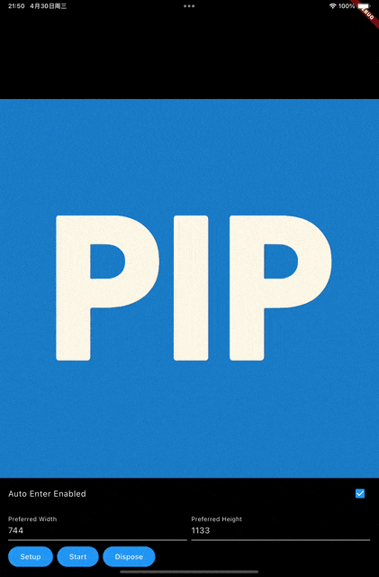
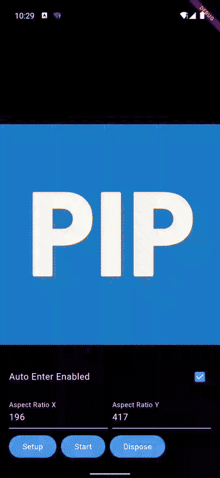

# pip

Flutter Picture in Picture plugin for Android and iOS with platform setup
helpers, state callbacks, and iOS native PiP view support.

## Preview





## Platform Support

| Platform | Minimum OS | Notes |
| --- | --- | --- |
| Android | API 26 for PiP support | Android 12+ supports native auto-enter. Android 11 and lower need a host activity that extends `PipActivity` if you want the plugin to bridge `onUserLeaveHint`. |
| iOS | iOS 15 for video-call PiP | Requires AVKit video-call PiP conditions and a native `UIView` that can be used as PiP content. |

## Installation

Add the plugin to your app:

```yaml
dependencies:
  pip: ^0.0.3
```

Then run:

```bash
flutter pub get
```

## Integration Model

`pip` is a single-package Flutter plugin. The Dart API handles capability
checks, setup, lifecycle requests, and state observation. Actual PiP rendering
still depends on host-platform requirements:

- Android PiP is owned by the system activity stack.
- iOS PiP is owned by AVKit and needs native content views rather than a pure
  Flutter widget tree.

Treat `setup()` as platform configuration, `start()` / `stop()` as requests,
and state callbacks as the source of truth for what actually happened.

## Android Setup

Enable PiP on the activity that hosts Flutter:

```xml
<activity
    android:name=".MainActivity"
    android:supportsPictureInPicture="true"
    android:configChanges="screenSize|smallestScreenSize|screenLayout|orientation" />
```

If you need the plugin to participate in Android 11 and lower auto-enter
behavior, make your activity extend `org.opentraa.pip.PipActivity` instead of
plain `FlutterActivity`:

```java
package com.example.app;

import org.opentraa.pip.PipActivity;

public class MainActivity extends PipActivity {
}
```

Android-specific `PipOptions` fields:

- `aspectRatioX` / `aspectRatioY`
- `sourceRectHintLeft` / `Top` / `Right` / `Bottom`
- `seamlessResizeEnabled`
- `useExternalStateMonitor`
- `externalStateMonitorInterval`

`sourceRectHint*` values must be provided together. `aspectRatioX` and
`aspectRatioY` must also be provided together.

## iOS Setup

On iOS, PiP content must come from a native `UIView` backed by renderable video
or sample-buffer content. The plugin exposes `getPipView()` and accepts
`sourceContentView` / `contentView` IDs in `PipOptions`, but your host app is
still responsible for creating those native views and keeping them renderable.

The bundled example uses `example/packages/native_plugin` only to demonstrate
how to create a native source view and a native PiP content view handle. That
helper package is not part of the public `pip` API contract.

If your app uses audio/video PiP on iOS, configure the required host-app
capabilities as well:

- Background modes appropriate for your playback/call scenario
- `AVAudioSession` configuration that matches your media behavior

iOS-specific `PipOptions` fields:

- `sourceContentView`
- `contentView`
- `preferredContentWidth`
- `preferredContentHeight`
- `controlStyle`

`preferredContentWidth` and `preferredContentHeight` must be provided together.

### iOS `controlStyle`

Supported values:

- `0`: default AVKit controls
- `1`: request documented linear-playback behavior
- `2`: hide play/pause button and progress bar using private iOS behavior
- `3`: hide all system controls using private iOS behavior

Values `2` and `3` rely on private iOS behavior. They are preserved for backward
compatibility because some integrations depend on them, but they increase App
Store review risk and may break on future iOS releases.

## Basic Usage

```dart
import 'package:pip/pip.dart';

final pip = Pip();
```

Check capabilities before setup:

```dart
final isSupported = await pip.isSupported();
final isAutoEnterSupported = await pip.isAutoEnterSupported();
final isActive = await pip.isActive();
```

Configure PiP:

```dart
final options = PipOptions(
  autoEnterEnabled: true,
  aspectRatioX: 16,
  aspectRatioY: 9,
);

await pip.setup(options);
```

Observe state changes:

```dart
await pip.registerStateChangedObserver(
  PipStateChangedObserver(
    onPipStateChanged: (state, error) {
      switch (state) {
        case PipState.pipStateStarted:
          break;
        case PipState.pipStateStopped:
          break;
        case PipState.pipStateFailed:
          debugPrint('PiP failed: $error');
          break;
      }
    },
  ),
);
```

Request lifecycle changes:

```dart
await pip.start();
await pip.stop();
await pip.dispose();
```

## API Semantics

- `start()` requests PiP start. A `true` return value means the platform call
  succeeded, not that the PiP window is already visible. Use state callbacks to
  observe the actual result.
- `stop()` is platform-dependent. On Android it cannot always force-close the
  system PiP window; in many cases it only returns the host activity toward the
  foreground/background flow.
- `isSupported()` means the device and OS support PiP primitives. It does not
  guarantee your manifest, activity type, AVKit setup, or native iOS view
  pipeline are fully configured.
- `isAutoEnterSupported()` is narrower than `autoEnterEnabled`. It tells you
  whether the current platform can honor auto-enter behavior.
- `isActive()` is the supported API. `isActived()` remains as a deprecated
  compatibility alias.
- Native state callbacks use stable string codes internally (`started`,
  `stopped`, `failed`) while still accepting older integer payloads for backward
  compatibility.

## Example App

See [`example/README.md`](example/README.md) for how to run the bundled sample.
The example demonstrates:

- Android manifest/activity setup with `PipActivity`
- Android aspect ratio and source-rect configuration
- iOS native source/content view wiring through the local `native_plugin`

## Notes

- Call `unregisterStateChangedObserver()` and `dispose()` when your integration
  no longer needs PiP resources.
- On iOS, you are responsible for the lifetime of the native content view you
  pass into `PipOptions`.
- On Android, `useExternalStateMonitor` exists because some host activity paths
  do not naturally forward PiP state changes back to Flutter.

## Release Process

Maintainers publish new versions through GitHub Actions:

- Run the `Release` workflow with the target version number.
- The workflow generates GitHub release notes, optionally prepends a GitHub
  Models summary, updates release metadata, and creates the GitHub Release
  using a `vX.Y.Z` tag.
- After reviewing the GitHub release, manually create and push a matching
  `X.Y.Z` tag to trigger the `Publish` workflow for `pub.dev`.

The `Publish` workflow depends on Dart automated publishing for GitHub Actions.
